# 数据结构!!!
## 链表
一个指向下\[上]一个元素的表  
单向:  
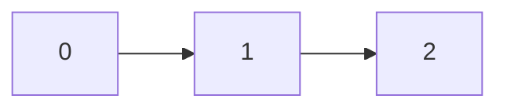
双向:  
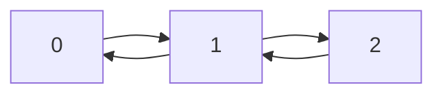
单向循环:  
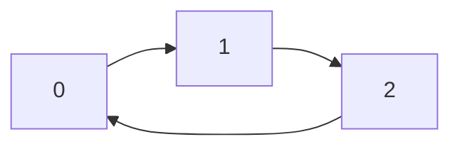
增加:   
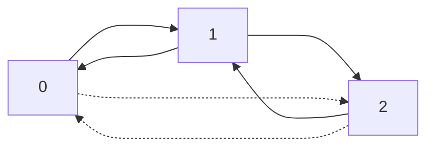
删除:  
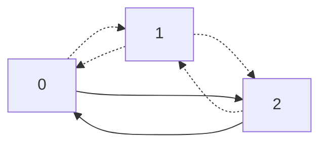
``` C++
struct Node{
  int data;
  Node *next=NULL,*pre=NULL;
}
void insert(Node* x,int s){  //在x后面插入d
  Node *d=new Node;
  d->data=s;
  x->next->pre=d;
  d->next=x->next;
  d->pre=x;
  x->next=d;
}
void deletes(Node *x){  //删除x
  x->pre->next=x->next;
  x->next->pre=x->pre;
  delete x;
}
```

## 栈
一个FILO(First in last out)的容器
``` C++
struct Stack{
  int *x,maxsize=-1,cnt=0;
  Stack(){
    x=new int[114];
    maxsize=114;
  }
  Stack(int size){
    x=new int[size];
    maxsize=size;
  }
  ~Stack(){
    delete []x;
  }
  void push(int s){
    if (cnt<maxsize) x[cnt++]=s;
  }
  int pop(){
    if (cnt>0)
    return x[--cnt];
  }
}
```

## 队列
FIFO(first in first out)容器
```C++
struct Que{
        int *x,cnth=0,cnte=0,size;
        Que(){
                size=5;
                x=new int[size];
        }
        Que(int s){
                size=s;
                x=new int[s];
        }
        void push(int s){
                x[cnth++]=s;
                cnth%=size;
        }
        int pop(){
                int r=x[cnte++];
                cnte%=size;
                return r;
        }
};

```
## 简单树

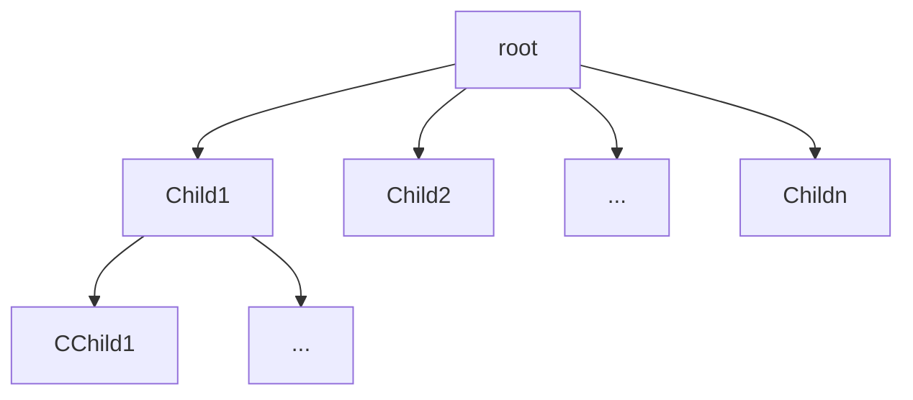

~ 懒得讲树的结构,就讲储存 ~  
储存方法:  
1. 存父亲
对于每个节点C,都指向父亲F
```C++
struct N{
  int data=0;
  int fa=-1;
}Tree[MAXN];
```

2. 存孩子
对于每个父节点F,都存有子节点 $C_1 , C_2 , ... , C_n$
```C++
struct N{
  int data=0;
  int *child=NULL;
}Tree[MAXN];
```
3. 小孩子才做选择
```C++
struct N{
  int data=0;
  int fa=-1;
  int *child=NULL;
}Tree[MAXN];
```

### 二叉树
人话:每个父只有两个子的树  

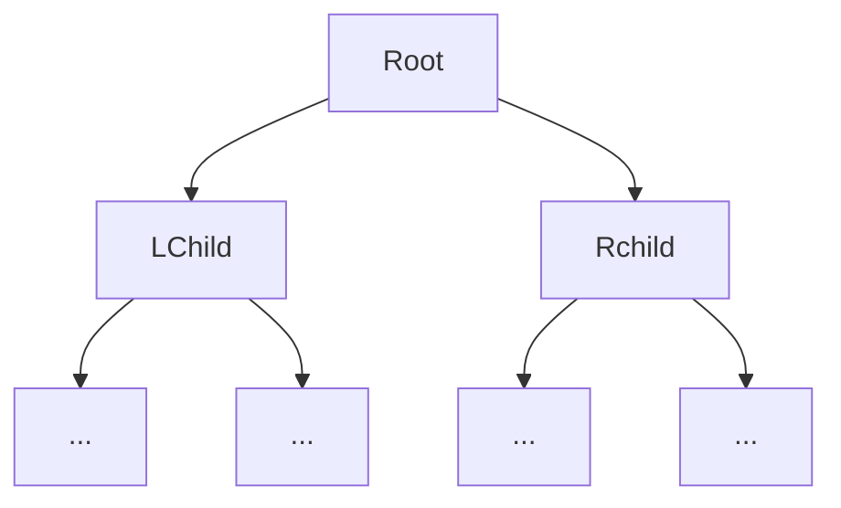

对于N层的二叉树,最多有:  
$1 + 2 + 4 + 8 + ... + 2^{N-1} = 2^{N} - 1$ 个节点

#### 遍历
前/中/后序 

前序: 根左右  
中序: 左根右  
后序: 左右根  

Eg:
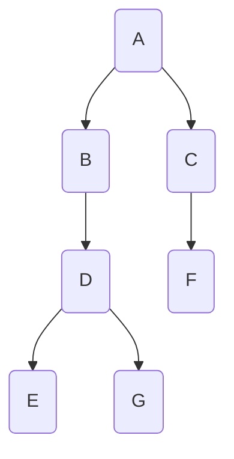
前序: ABDEGCF  
中序: EDGBACF  
后序: EGDBFCA  

如何根据前序和中序还原树:  
以上文ABDEGCF和EDGBACF为例子:  
易得A为根,EDGB为左子,CF为右子  
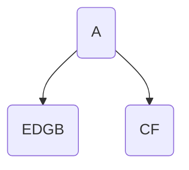
然后剩余前序为:BDEGCF,B为根,所以有以B为根的树为A的左子,EDG为B的左子  
剩余DEGCF
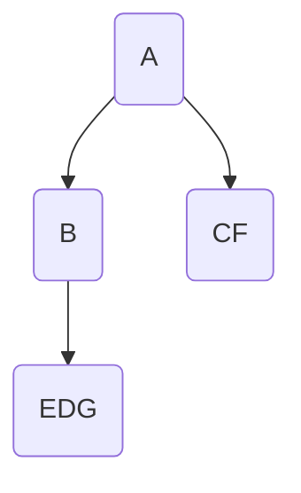
同理可以得到:  
D为根,E,G为D的左右子,由于EG为叶子(由中序得)  
所以可以直接删去DEG,余CF  

C为根,有唯一子F

所以就得到了:


#### 满二叉树
除最后一层都是满的且最后一层从左到右分布子
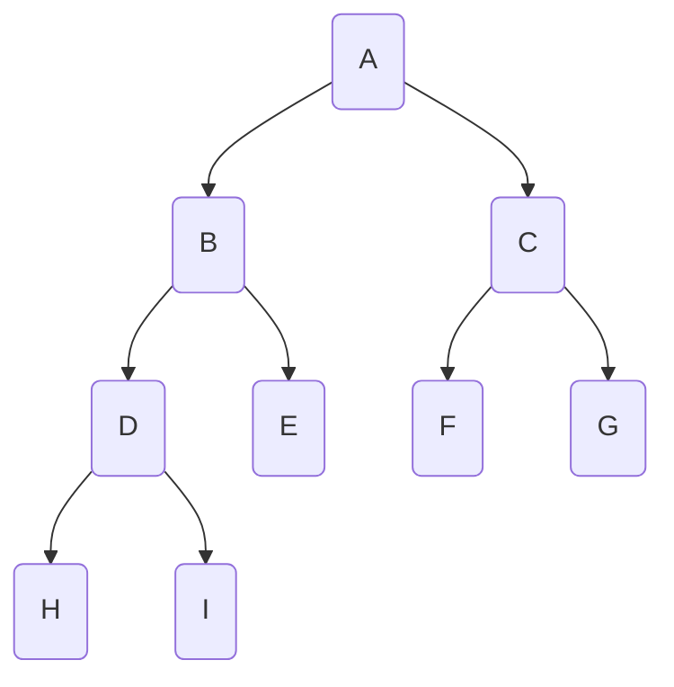
#### 哈夫曼
WPL是带权路径长,  
设有n个节点对于节点i有权值 $W_i$ 和距离根的距离 $L_i$  
有:  
$WPL = \Sigma^{n}_ {i = 1} W_{i}L_{i}$  
而哈夫曼编码就是找到一颗WPL最小的树  
哈夫曼树不唯一  
方法:
将值{ $a_1,a_2,a_3,a_4,...,a_n$ }转为带权森林{ $T_1,T_2,T_3,T_4,...,T_n$ }  
将最小的两个组合到一起,形成一颗新的树,根的权值为两个子的权值和  
重复  
实践:  

首先,最小的是1,2  
就有了  
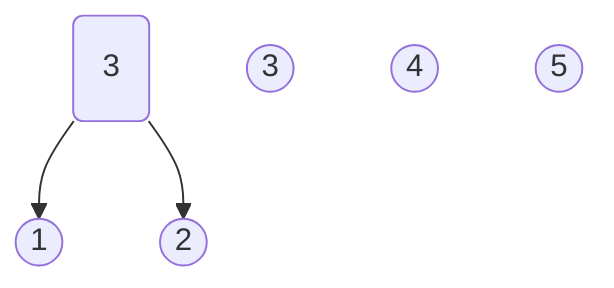
又有此时最小为3,3  
有  
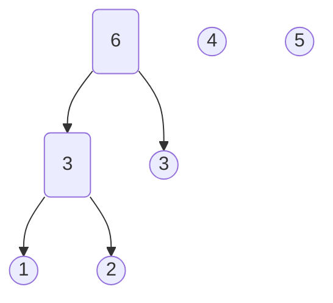
以此类推
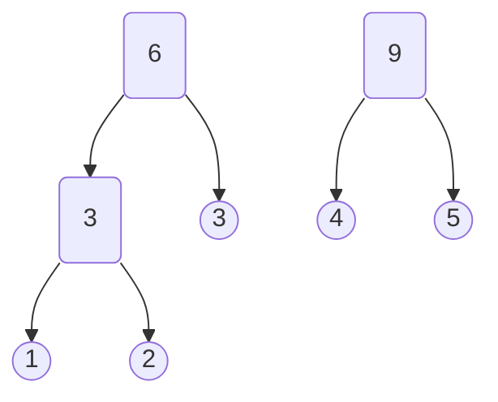

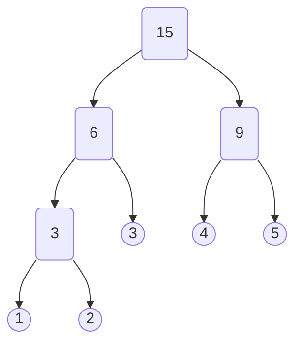

```C++
graph TB
struct Tree{
	int w;
	int cnt;
	int l,r;
}HTree[114514];
bool operator < (Tree a,Tree b){
	return a.w>b.w;
}
int cnt=0;
int huffman(int *a,int size){		//返回根
	priority_queue<Tree> q;
	for (int i=0;i<size;i++){
		HTree[cnt].w=a[i];
		HTree[cnt].cnt=cnt;
		HTree[cnt].l=HTree[cnt].r=-1;
		q.push(HTree[cnt++]);
	}
	Tree x;
	Tree b;
	while (q.size()>1){
		x=q.top();
		q.pop();
		b=q.top();
		q.pop();
		HTree[cnt].w=x.w+b.w;
		HTree[cnt].cnt=cnt;
		HTree[cnt].r=x.cnt;
		HTree[cnt].l=b.cnt;
		q.push(HTree[cnt++]);
	}
	return cnt-1;
}

```

#### 二叉搜索
对于一个父节点的左子和右子,设:根为F,左右子为:L,R  
有:
$L < F < R$
搜索时只要:当x小于父去左子,大于去右子  
```C++
struct Tree{
	int w;
	int l=-1,r=-1;
}Trees[114514];
int cnt=0;
void insert(int x){
	if (cnt==0){
		Trees[0].w=x;
		cnt++;
	}
	else{
		Tree *now=&Trees[0];
		while (true){
			if (x>now->w)
			if (now->r==-1){
				now->r=cnt;
				Trees[ cnt++ ].w=x;
				return;
			}else{
				now=&Trees[now->r];
			}
			else if(x<now->w)
			if (now->l==-1){
				now->l=cnt;
				Trees[cnt++].w=x;
				return;
			}else{
				now=&Trees[now->l];
			}
			if (x==now->w) return;
		};
	}
}
//还有查找删除遍历的坑没填233	
```

## 简单图(WC怎么到图论前置了)
J要知道的:  
图是由一堆点和边组成的  
有`G=(V,E)`  
其中G表示图,V为点集,E为边集  

有向图:有方向的图
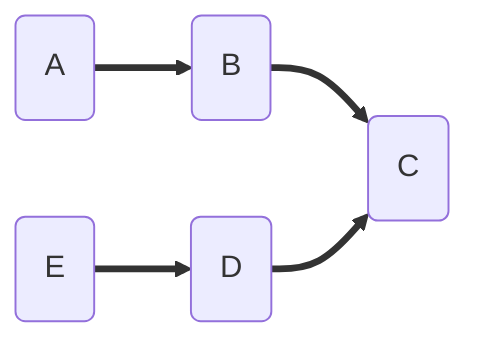
无向图:没方向的图
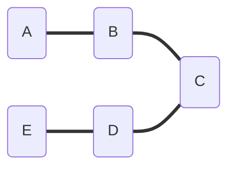
环:
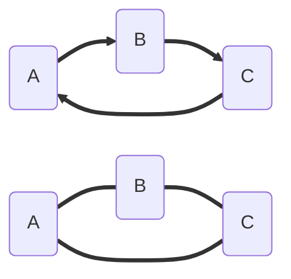
有n个点的简单无向完全图有 $\Sigma^{n}_{i=1} (n-i) = \frac{n(n-1)}{2}$ 条边  
简单有向图由于两个点间最多有2条边  
所以就有 $n(n-1)$ 条边  
储存方式:  
邻接矩阵  
对于图
```mermaid
graph LR
A(A)
B(B)
C(C)
D(D)
A==>B
A==>C
C==>B
B==>D
```
用邻接矩阵表示为:
```C++
{// from A B C D
	 0,0,0,0, //A
	 1,0,1,0, //B
	 1,0,0,0, //C
	 0,1,0,0  //D
}
```

邻接表:  
就是对于每个点,储存它的内容和边的关系  
```C++
struct Node{
	int data;
	vector<int>next;
}Nodes[MAXN];
int cnt=0;
void adde(int a,int b){ 		//a-->b
	Nodes[a].next.push_back(b);
}
int addv(int a){
	Nodes[cnt].data=a;
	return cnt++;
}
```

***~数据结构就到这了,再有也不讲了~***
