# 数据结构!!!
## 链表
一个指向下\[上]一个元素的表  
单向:  
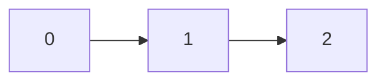
双向:  
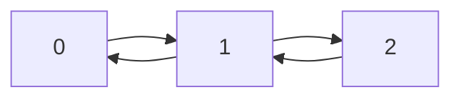
单向循环:  
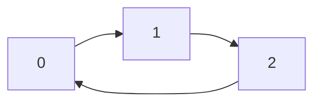
增加:   
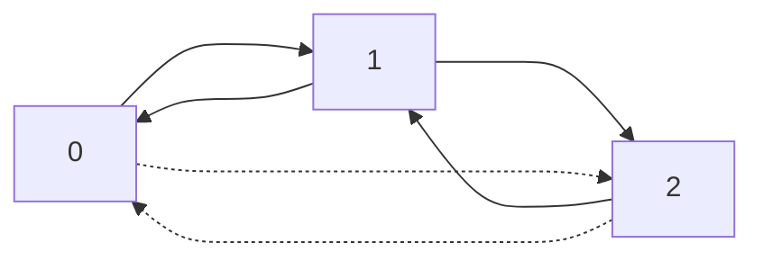
删除:  
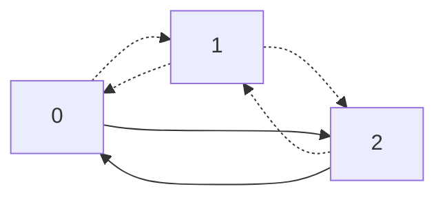
``` C++
struct Node{
  int data;
  Node *next=NULL,*pre=NULL;
}
void insert(Node* x,int s){  //在x后面插入d
  Node *d=new Node;
  d->data=s;
  x->next->pre=d;
  d->next=x->next;
  d->pre=x;
  x->next=d;
}
void deletes(Node *x){  //删除x
  x->pre->next=x->next;
  x->next->pre=x->pre;
  delete x;
}
```

## 栈
一个FILO(First in last out)的容器
``` C++
struct Stack{
  int *x,maxsize=-1,cnt=0;
  Stack(){
    x=new int[114];
    maxsize=114;
  }
  Stack(int size){
    x=new int[size];
    maxsize=size;
  }
  ~Stack(){
    delete []x;
  }
  void push(int s){
    if (cnt<maxsize) x[cnt++]=s;
  }
  int pop(){
    if (cnt>0)
    return x[--cnt];
  }
}
```

## 队列
FIFO(first in first out)容器
```C++
struct Que{
        int *x,cnth=0,cnte=0,size;
        Que(){
                size=5;
                x=new int[size];
        }
        Que(int s){
                size=s;
                x=new int[s];
        }
        void push(int s){
                x[cnth++]=s;
                cnth%=size;
        }
        int pop(){
                int r=x[cnte++];
                cnte%=size;
                return r;
        }
};

```
## 简单树

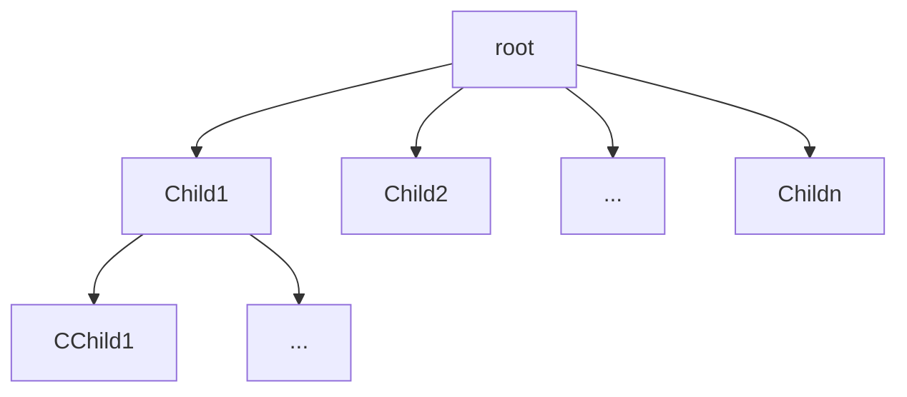

~ 懒得讲树的结构,就讲储存 ~  
储存方法:  
1. 存父亲
对于每个节点C,都指向父亲F
```C++
struct N{
  int data=0;
  int fa=-1;
}Tree[MAXN];
```

2. 存孩子
对于每个父节点F,都存有子节点 $C_1 , C_2 , ... , C_n$
```C++
struct N{
  int data=0;
  int *child=NULL;
}Tree[MAXN];
```
3. 小孩子才做选择
```C++
struct N{
  int data=0;
  int fa=-1;
  int *child=NULL;
}Tree[MAXN];
```

### 二叉树
人话:每个父只有两个子的树  

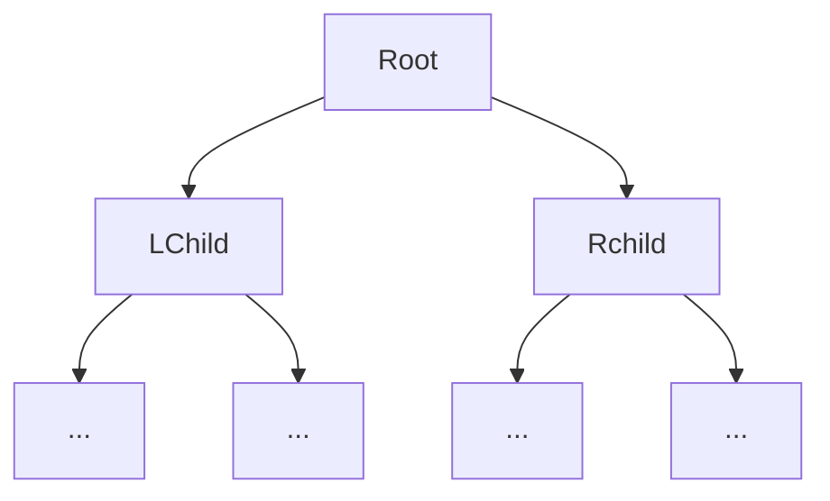

对于N层的二叉树,最多有:  
$1 + 2 + 4 + 8 + ... + 2^{N-1} = 2^{N} - 1$ 个节点

#### 遍历
前/中/后序 

前序: 根左右  
中序: 左根右  
后序: 左右根  

Eg:
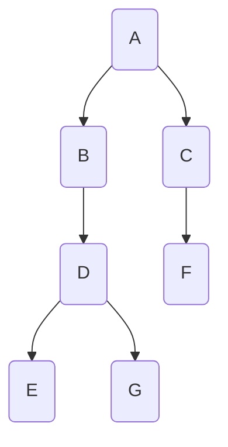
前序: ABDEGCF  
中序: EDGBACF  
后序: EGDBFCA  

如何根据前序和中序还原树:  
以上文ABDEGCF和EDGBACF为例子:  
易得A为根,EDGB为左子,CF为右子  
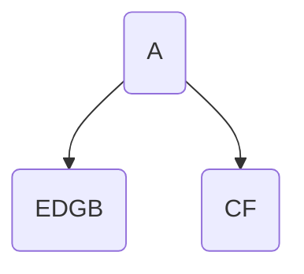
然后剩余前序为:BDEGCF,B为根,所以有以B为根的树为A的左子,EDG为B的左子  
剩余DEGCF
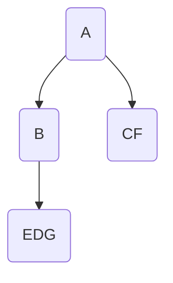
同理可以得到:  
D为根,E,G为D的左右子,由于EG为叶子(由中序得)  
所以可以直接删去DEG,余CF  

C为根,有唯一子F

所以就得到了:


#### 满二叉树
除最后一层都是满的且最后一层从左到右分布子
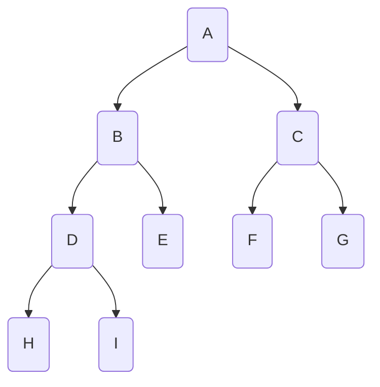
#### 哈夫曼
WPL是带权路径长,  
设有n个节点对于节点i有权值 $W_i$ 和距离根的距离 $L_i$  
有:  
$WPL = \Sigma^{n}_{i=1} W_{i}L_{i}$
#### 二叉搜索
对于一个父节点的左子和右子,设:根为F,左右子为:L,R  
有:
$L < F < R$

